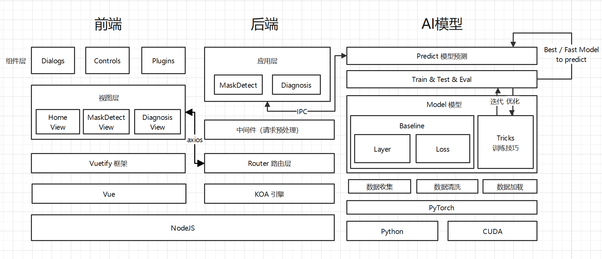
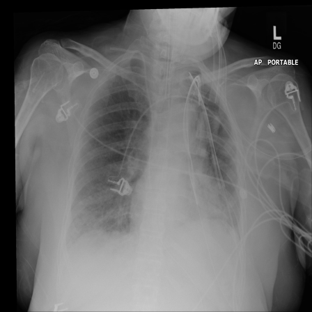
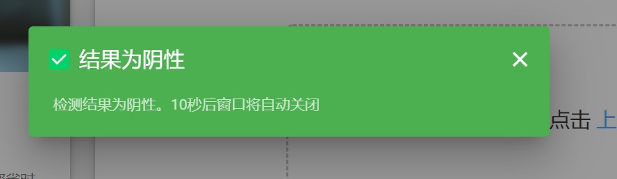
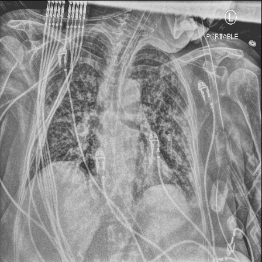
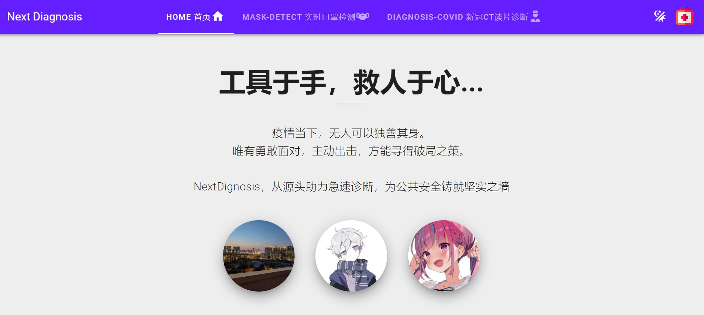
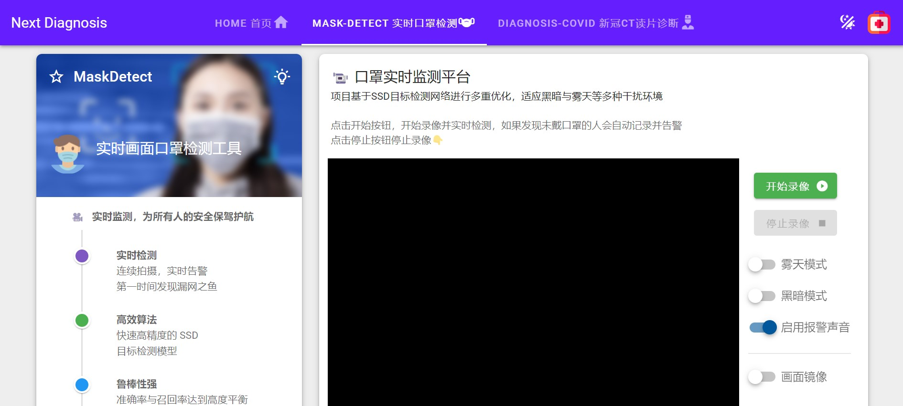
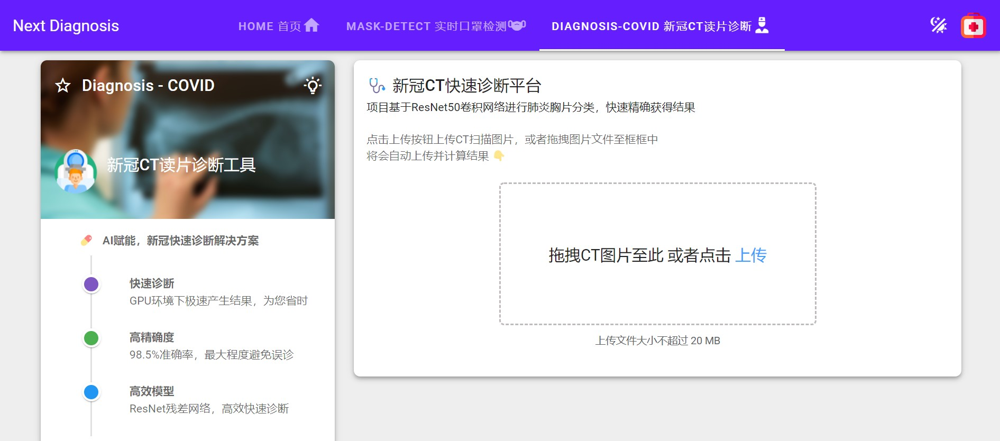
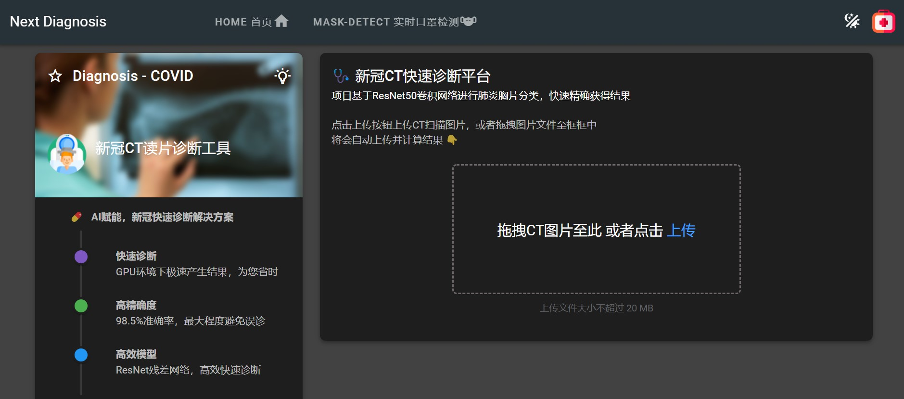

# 架构图



# AI模型部分 - 本地训练与测试

## 🛠 环境配置

使用 `pip` / `conda` 安装项目所需要的对应 python 依赖库

```shell
pip install -r requirements.txt
```

## 🎨 口罩实时识别系统

### 安装说明

#### 训练方式

- 在 `MaskDetect` 工作目录下打开代码

- 在 `config.py` 文件中按照注释指引调整训练方式与所需要的 **tricks**

- 运行 `voc_annotation.py` 文件生成**标注信息**

  ```shell
  python3 voc_annotation.py
  ```

- 在 `train.py` 中设置训练时所使用的**参数**

- 运行 `train.py` 文件开启本地训练

  ```shell
  python3 train.py
  ```

- 训练时生成的检查点文件与**日志**文件保存在 `logs` 目录内，可以在此处观察训练情况

- 训练好的 pth **权值文件**建议移动到 `model_data` 目录下

#### 测试方式

- 在 `ssd.py` 中将 `model_path` **指向训练生成的 pth 权值文件**，同时按照需求配置其他参数文件

- 运行 `get_map.py` 文件获取在测试集上的评估结果

  ```shell
  python3 get_map.py
  ```

- 评估的结果保存在 `map_out` 目录下

#### 预测方式

- 在 `ssd.py` 中将 `model_path` **指向训练生成的 pth 权值文件**，同时按照需求**配置其他参数**文件

- 在 `predict.py` 中配置预测时的参数

- 运行 `predict.py` 开始预测

  ```shell
  python3 predict.py
  ```

- 循环传入要**预测的图像的路径**，在控制台获取是否戴口罩与人脸位置信息以及置信度的结果

### 设计思路

- 使用 **SSD** 目标检测网络进行高精度的实时目标检测

  

- 针对具体业务场景进行迭代优化

  - **小目标与密集目标检测**

    - **FPN** 机制 + **SE** 注意力机制

      

      

      

    - **anchor 尺度**场景重设计

    - 在更大的图像尺度进行训练与测试（**512*512**）

    - 改进的 **Mosaic** 图像增强

    - 小目标随机复制粘贴增强（相当于一种**过采样**策略）

  - 过拟合

    - **MixUp** 图像增强技术
    - **Mosaic** 图像增强技术
    - **标签平滑**分类损失（增加随机性）

  - 类别/难易/正负样本不均衡

    - **Focal Loss**

  - 实时性与可部署性

    - **MobileNet 轻量化可分离卷积网络**

  - 抗干扰环境

    - 雾天模式：**暗通道先验去雾**
    - 黑暗模式：**直方图均衡化**增强对比度

  - 其它训练技巧

    - 更强大的预训练网络：在 **VOC07+12** 数据集训练过的网络上进行微调
    - 学习率策略：**WarmUp + 余弦学习率衰减**

- 消融实验

  ##### 口罩检测小数据集(1200trainval+400test)的用于baseline选取的测试性能(mAP0.5)

  | VGG16-Pretrained-FT | VOC07+12-Pretrained-FT(cos-warmup-lr) | anchor[0]=21 |    mAP    |
  | :-----------------: | :-----------------------------------: | :----------: | :-------: |
  |          ✅          |                                       |              |   53.42   |
  |                     |                   ✅                   |      ✅       | **57.64** |
  |          ✅          |                                       |      ✅       |   54.31   |

  ##### 口罩检测大数据集(1w+)上训练的测试性能(mAP0.5)

  | MixUp  |   Mosaic   | Focal Loss | Label Smoothing |  FPN  |  SE   | 512*512 | Paste |    mAP    |
  | :----: | :--------: | :--------: | :-------------: | :---: | :---: | :-----: | :---: | :-------: |
  |        |            |            |                 |       |       |         |       |   71.93   |
  | p=0.2✅ |            |            |                 |       |       |         |       |   73.17   |
  |        |   p=0.2✅   |            |                 |       |       |         |       |   74.59   |
  |        |            |     ✅      |                 |       |       |         |       |   73.53   |
  |        |            |            |      **✅**      |       |       |         |       |   73.87   |
  |        |            |            |                 |   ✅   |       |         |       |   73.73   |
  |        |            |            |                 |       |   ✅   |         |       |   74.28   |
  |        |            |            |                 |       |       |  **✅**  |       |   78.88   |
  |        |            |            |                 |       |       |         |   ✅   |   73.72   |
  |        |            |            |                 | **✅** | **✅** |         |       |   74.94   |
  |        |   p=0.2✅   |            |                 |   ✅   |   ✅   |         |       |   75.20   |
  |        |   p=0.2✅   |     ✅      |                 |       |       |         |       |   73.72   |
  |        |   p=0.2✅   |            |        ✅        |       |       |         |       |   72.94   |
  | p=0.2✅ |   p=0.2✅   |     ✅      |                 |       |       |         |       |   72.74   |
  | p=0.2✅ |   p=0.2✅   |            |        ✅        |       |       |         |       |   73.55   |
  |        |   p=0.2✅   |            |      **✅**      | **✅** | **✅** |         |       |   77.26   |
  |        | **p=0.2✅** |            |      **✅**      | **✅** | **✅** |  **✅**  |       | **81.11** |

### 检测效果

#### 正常检测

- 正常口罩检测效果

  

- 正常不带口罩检测效果

  

#### 密集小目标检测：该图与下图的所有人脸小目标均被精确完整的检测出来


#### 对遮挡人脸的检测：观察下图有一些难以检测的遮挡人脸信息被完整捕获


#### 多口罩种类适应性


#### 模糊背景的适应性


#### 雾天模式：去雾前检测（上半部分）与去雾后检测（下半部分）


#### 其它


## 📝 COVID-19 肺炎胸片诊断系统

### 安装说明

#### 训练方式

- 在 `DiagnosisCOVID` 目录下打开代码
- 打开 `train.py` 文件并执行
  - 观察 `argparse` **参数**并在文件内修改配置参数保存后运行
  - 使用 `argparse` 传递参数法则在 **shell** 传递训练配置参数

#### 测试方式

- 在` test.py` 中**修改测试模型的参数**，`model_path` **指向训练好的模型权重**，详情见 `argparse` 设置的模型参数
- 执行 `test.py` 文件

#### 预测方式

- 在 `predict.py` 中**修改预测的参数**，`model_path` 指向训练好的模型权重，`img_path` **指向要传入识别的胸片图像路径**，详情见 `argparse` 设置的模型参数
- 执行 `predict.py` 文件
- 执行后即可打印出阳性或阴性的检测结果

### 设计思路

- **ResNet50** 图像分类网络

  

  

  

- **数据增强**

  - **Random Erasing**

  - **MixUp**

- **多尺度训练与多尺度测试**

- 消融实验

  | MixUp | Random Erasing | Mutiscale Training/Testing(Voting) |  Accuracy  |  F1-Score  |
  | :---: | :------------: | :--------------------------------: | :--------: | :--------: |
  |       |                |                                    |   97.00%   |   97.09%   |
  |       |       ✅        |                                    |   97.50%   |   97.56%   |
  |   ✅   |                |                                    |   97.75%   |   97.80%   |
  | **✅** |                |               **✅**                | **98.50%** | **98.50%** |

### 检测效果

#### 阴性病例





#### 阳性病例




# 前后端部分 - 部署与使用

项目架构前后端分离，后端与AI模型位于同一位置，前端可以部署至其他设备

## 💻 后端

### 安装说明

#### 安装环境与依赖

1. 安装 **NodeJS 16.13 以上** 版本，以保证所有API可用
2. shell 执行`npm install --global yarn pm2`命令安装包管理器和 pm2 进程守护工具
3. 切换到项目下的`Backend`目录
4. shell 执行 `yarn` 命令安装依赖包

#### 启动后端

> pm2 将实时监控后端代码变化，并适时自动重启后端，无需人工干预

- 执行 `pm2 start ecosystem.config.js` 命令启动后端运行
- Windows系统用户可以直接 **双击运行** `Start.cmd` 脚本启动后端

#### 关闭后端

- 执行 `pm2 stop ecosystem.config.js` 命令停止后端运行
- Windows 系统用户可以直接 **双击运行** `Stop.cmd` 脚本关闭后端

#### 状态实时监控

- 执行 `pm2 monit` 命令打开进程状态实时监控窗口，查看资源占用与后端进程工作状况
- Windows 系统用户可以直接 **双击运行** `Monitor.cmd` 脚本打开状态实时监控窗口

#### 配置文件

配置文件位于项目 `Backend/config/config.js` ，可以修改部分后端应用相关参数

## 📈 前端

### 安装说明

#### 开发环境安装

1. 安装 **NodeJS 16.13 以上** 版本，以保证所有API可用
2. shell 执行`npm install --global yarn`命令安装包管理器
3. 切换到项目下的`Frontend`目录
4. shell 执行 `yarn` 命令安装依赖包

#### 启动开发调试服务器

> vue-cli 将实时监控前端代码变化，并适时自动重新编译，无需人工干预

- 执行 `yarn serve` 命令启动 `vue-cli` 调试服务器，Vue编译、Babel、Webpack 执行完毕之后将输出工作端口
- 使用浏览器打开给出的地址即可进行前端使用与调试
- Windows系统用户可以直接 **双击运行** `DevServer.cmd` 脚本启动

**提示：**默认情况下，前端将连接到默认后端工作地址 `http://localhost:6006`。如果前后端分离开发，请前往 `vue.config.js` 修改 devServer 的 proxy 地址

#### 关闭调试服务器

按下 Ctrl+C 中断程序

#### 配置文件

配置文件位于项目 `Backend/src/config/config.js` ，可以修改部分前端应用相关参数 

#### 生产环境编译打包

- 执行 `yarn build` 命令启动生产环境编译打包
- Windows系统用户可以直接 **双击运行** `BuiltDist.cmd` 脚本启动编译打包

工作完毕后，将在项目 `Frontend/dist` 目录生成打包完毕的前端应用

#### 生产环境部署

以 nginx 服务端为例：

1. 将打包好的前端应用整体置入 `html` 目录

2. 修改 `conf/nginx.conf` 配置文件，将缺省 API 路径映射到实际后端地址  
   在 `server ` 块中增加如下内容

   ```nginx
   location ^~/api {
   	proxy_pass   <实际后端工作地址>;
       # 修改为后端实际的工作地址，如 proxy_pass http://11.22.33.44:7890; 
   	add_header Access-Control-Allow-Methods *;
   	add_header Access-Control-Max-Age 3600;
   	add_header Access-Control-Allow-Credentials true;
   	add_header Access-Control-Allow-Origin $http_origin;
   	add_header Access-Control-Allow-Headers $http_access_control_request_headers;
   	if ($request_method = OPTIONS ) {
   		return 200;
   	}
   }
   ```

3. 启动 nginx ，对外提供服务

## 🔍 相关介绍

### 基础架构

- 由于需要考虑到多种平台可用、多种环境可用的实际情况，我们在前端最终采取了基于浏览器的设计方案。前端平台无需手动适配各种机型，只要拥有浏览器即可进行访问，兼容性强
- 得益于 Vue 原生的思想，在代码过程中对各组件进行了一定程度的复用，组件复用带来了较好的系统扩展性
- 后端基于 NodeJs 开发 RESTful 服务端，在开发过程中使用异步模型原生支持多请求处理，无需额外对线程分配进行干预

### UI 设计

- 在 UI 设计方面，选择 Vuetify 框架进行 UI 开发，控件的 Material Design 交互设计对系统整体美观度和使用体验有很大提升
- 对于工具包设计而言，可扩展性有一定的要求。目前UI系统共分为首页、口罩检测、CT诊断三大页面，可以方便地根据业务需求增加新的工具页面，组件复用有助于更快地完成相关拓展工作

### 部署与运行

- 前端通过 webpack 打包 polyfill，编译过程中对旧版浏览器内核进行一定的支持
- 由于前后端分离，两者之间使用 axios 进行异步请求，整体工作灵活性较高，两部分互不影响，可以根据实际需求灵活地部署前端，而无需单独考虑后端的情况
- 后端基于 NodeJs 开发，原生拥有跨平台工作能力。优势在于部署极为方便，同时前后端分离的设计便于后续扩容与负载均衡等技术实现
- RESTful 接口可供其他类似服务进行 RPC 调用，或者拓展出公共接口，系统整体拓展性较好

## 📺 演示效果

### 首页 - 简单的项目介绍



### 组件一 - 实时口罩检测平台



### 组件二 - 新冠CT实时诊断平台



### 夜间模式



# Reference

## 📌 数据集

[Kaggle-医学影像-COVID19-胸片数据集](https://www.kaggle.com/datasets/andyczhao/covidx-cxr2?select=train.txt)

[口罩检测数据集1](https://github.com/DataXujing/DIoU_YOLO_V3)

[口罩检测数据集2](https://github.com/Bil369/MaskDetect-YOLOv4-PyTorch)

## 🌍 开源项目引用

[PyTorch](https://github.com/pytorch/pytorch)

[SSD-pytorch](https://github.com/bubbliiiing/ssd-pytorch)

[Vue2](https://cn.vuejs.org/index.html)

[Vuetify](https://github.com/vuetifyjs/vuetify)

[Koa2 系列](https://github.com/koajs)

## 📖 参考文献

[SSD: Single Shot MultiBox Detector](https://arxiv.org/abs/1512.02325)

[Deep Residual Learning for Image Recognition](https://arxiv.org/abs/1512.03385)

[When Does Label Smoothing Help](https://arxiv.org/abs/1906.02629)

[Feature Pyramid Networks for Object Detection](https://arxiv.org/abs/1612.03144)

[Squeeze-and-Excitation Networks](https://arxiv.org/abs/1709.01507)

[YOLOv4: Optimal Speed and Accuracy of Object Detection](https://arxiv.org/abs/2004.10934)

[mixup: Beyond Empirical Risk Minimization](https://arxiv.org/abs/1710.09412)

[Focal Loss for Dense Object Detection](https://arxiv.org/abs/1708.02002)

[Random Erasing Data Augmentation](https://arxiv.org/abs/1708.04896)

[SGDR: Stochastic Gradient Descent with Warm Restarts](https://arxiv.org/abs/1608.03983)

[Single Image Haze Removal Using Dark Channel Prior](https://ieeexplore.ieee.org/abstract/document/5567108)
