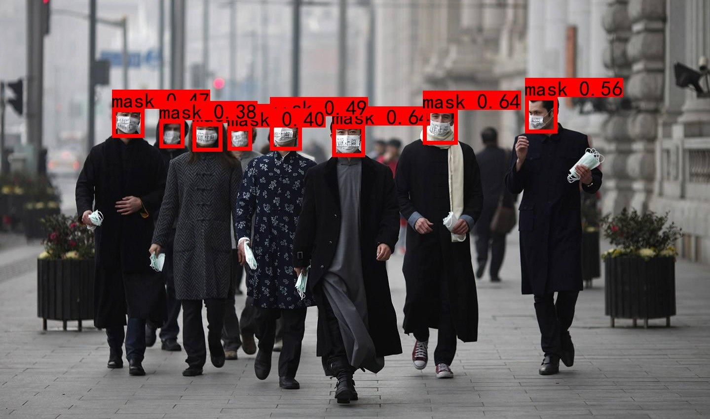
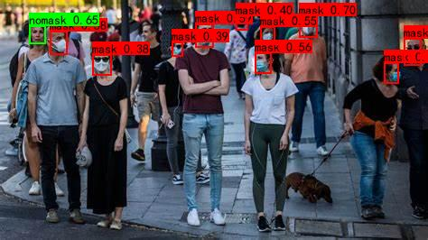
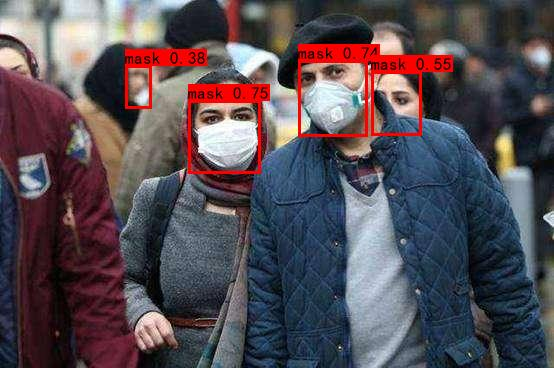
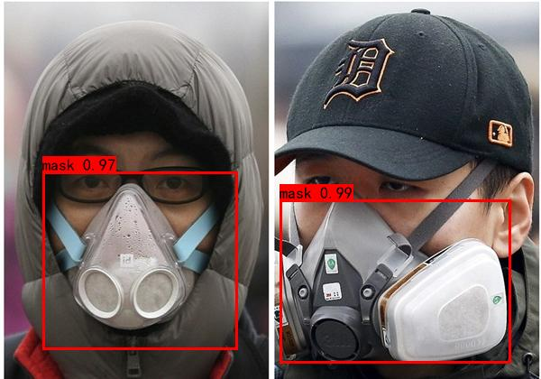
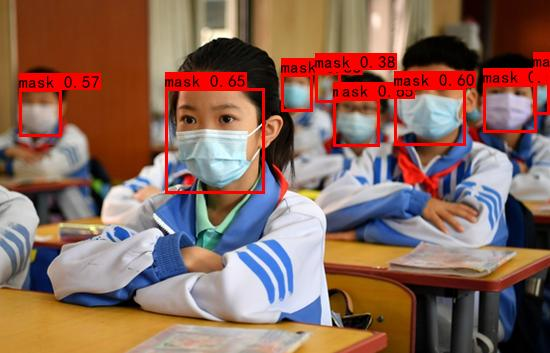
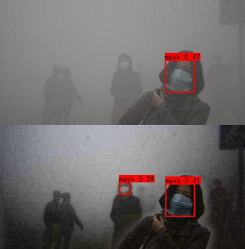
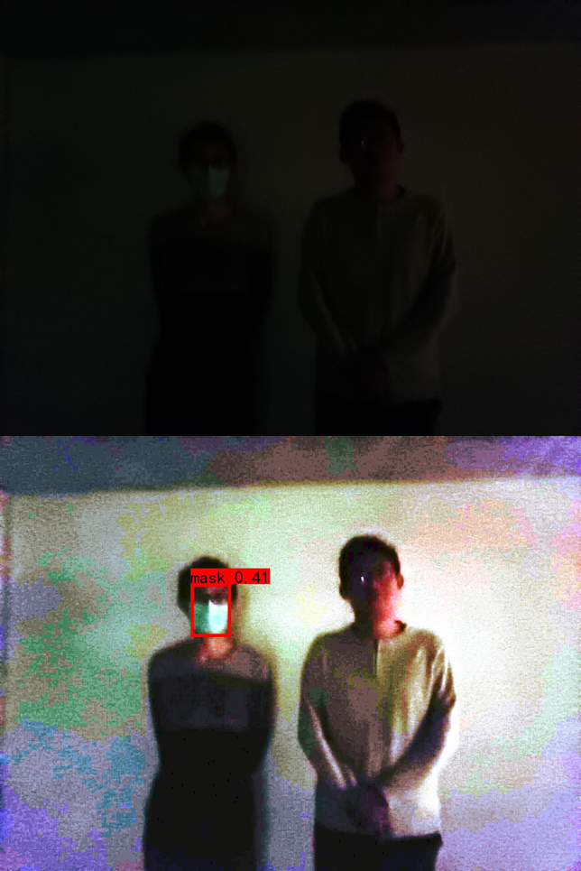
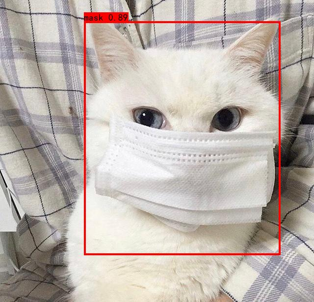
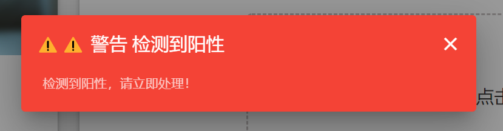

## AI模型部分 - 口罩摘带识别测试效果

### 正常口罩检测效果

### 正常不带口罩检测效果

### 密集小目标检测

- 该图与下图的所有人脸小目标均被精确完整的检测出来

### 对遮挡人脸的检测

- 观察下图有一些难以检测的遮挡人脸信息被完整捕获

### 多口罩种类适应性

### 模糊背景的适应性

### 雾天模式

- 去雾前检测（上半部分）与去雾后检测（下半部分）对比

### 黑暗环境

- 启用黑暗模式前检测（上半部分）与启用黑暗模式后检测（下半部分）对比

### 其它

## AI模型部分 - 肺炎胸片诊断

### 阴性病例

### 阳性病例

## 前后端部分 - UI界面展示

### 首页 - 简单的项目介绍

### 组件一 - 实时口罩检测平台

### 实际工作场景

### 组件二 - 新冠CT实时诊断平台

### 夜间模式

### 文件上传后诊断结果展示

