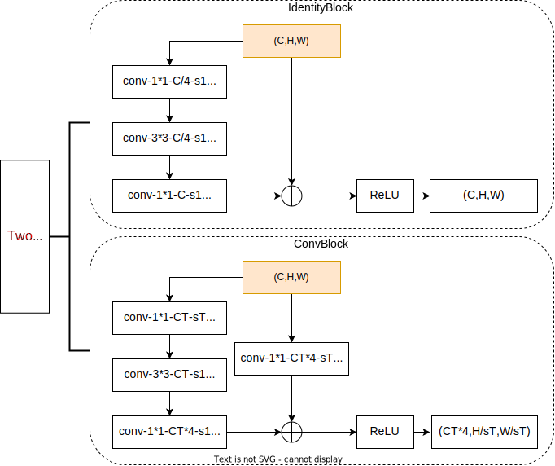
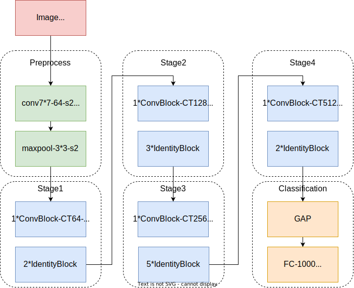

# 设计思路

## 整体系统架构

### 架构图

### 设计思路

项目的设计思想为聚合工具包，将防控相关工具聚合至统一平台，在合适的场景之下分别使用。聚合的相关设计有助于算力整合，降低部署难度，充分利用系统资源，提高一体化防控的效果和能力。

## 口罩检测任务模型分析

- 使用 SSD 目标检测网络进行高精度的实时目标检测
- 针对具体业务场景进行迭代优化（详情见**重点难点**文档部分）
  - 小目标与密集目标检测
    - FPN 机制
    - anchor 尺度场景重设计
    - 在更大的图像尺度进行训练与测试（512*512）
    - 改进的 Mosaic 图像增强
    - 小目标随机复制粘贴增强（相当于一种过采样策略）
  - 过拟合
    - MixUp 图像增强技术
    - Mosaic 图像增强技术
    - 标签平滑分类损失（增加随机性）
  - 类别/难易/正负样本不均衡
    - Focal Loss
  - 实时性与可部署性
    - MobileNet 轻量化可分离卷积网络
  - 抗干扰环境
    - 雾天模式：暗通道先验去雾
    - 黑暗模式：直方图均衡化增强对比度
  - 其它训练技巧
    - 更强大的预训练网络：在 VOC07+12 数据集训练过的网络上进行微调
    - 学习率策略：WarmUp + 余弦学习率衰减
- 消融实验
- 前后端分离部署：跨平台可用，兼容性强

## 肺炎胸片检测模型分析

- 使用 ImageNet 1k 预训练过的 ResNet50 网络进行微调
- Tricks
  - MixUp 图像增强
  - Random Erasing 图像增强
  - 多尺度训练与测试
- 消融实验
- 前后端分离部署：跨平台可用，兼容性强

## SSD 目标检测模型介绍

### SSD 模型的数据预处理与数据增强

- 数据增强顺序与每一种增强方式发生均设置了一定的概率，**具有一定的随机性**，极大的保证了数据的丰富性，大量的数据增强极大的提升了 SSD 目标检测算法的检测性能
- **光学变换**的数据增强在 RGB 与 HSV 色彩空间转化进行多种变换，极大的丰富了图像的表达能力
- 随后的**几何变换**通过截取、扩充、镜像等操作实现了图像的几何增强

### 检测网络的设计

- 模型网络结构采用了 **VGG16** 作为骨干网络，并在网络上进行了一定修改，是一个全卷积网络
- conv4_3 卷积层后加入了 **L2 Norm** 层来规范数据，防止数据落在饱和区
- 直到 conv_5 网络前均采用了 VGG16 骨干网络的架构，在随后的最大值池化层中修正池化层为池化步长为1、池化窗口大小为 3 的结构，因此在 Conv6 卷积层下采样率为 16，这一操作**增加了感受野且特征图尺寸不发生改变**
- 为了适应池化层的改变，在**生成 Conv6 层时使用空洞数为 6 的空洞卷积**，在特征图尺寸与参数两不改变的情况下增加了感受野
- 网络可以分为**三个部分**：第一部分为 VGG16 backbone；第二部分为网络额外进行降采样生成的后续卷积层；第三部分为用于在多尺度特征图上回归与分类 PriorBox 的横向连接层

### PriorBox 尺度的确定

$$
s_{k}=s_{\min }+\frac{s_{\max }-s_{\min }}{5}(k-1) \quad k \in[1, 6] \\
在实验中，s_{min}=0.2，s_{max}=0.9 ,其中 k 为特征层层数\\
其中 1-6 对应着 Conv4-Conv7-Conv8-Conv9-Conv10-Conv11 \\共计六个特征图的 PriorBox 尺度\\随着层数尺度对应线性增加
$$

$$
对于 300*300 的输入图像，在六个特征图中PriorBox尺寸设置依次为 [30,60,111,162,213,264]\\
同时六个特征图中在每个点上分别生成[4,6,6,6,4,4]个 PriorBox\\若为生成 4 个 PriorBox 的层\\它们对应尺度宽高分别为\{s_k,s_k\}、\{\frac{s_k}{\sqrt2},\sqrt2s_k\}、\{\sqrt2s_k,\frac{s_k}{\sqrt2}\}、\{\sqrt{s_ks_{k+1}},\sqrt{s_ks_{k+1}}\}\\对于生成 6 个 PriorBox 的层\\多出两个长宽尺度为\{\frac{s_k}{\sqrt3},\sqrt3s_k\}、\{\sqrt3s_k,\frac{s_k}{\sqrt3}\}的 PriorBox 的候选框
$$

- **举例**：对于 Conv8 生成的特征图生成 PriorBox
  - 首先读取 Conv8 输入特征图的尺寸为 10*10，随后读取每个点生成 PriorBox 的数目为 6，因此该处生成 600 个候选框。
  - 对于每个点，如特征图上第一个点 (0,0) 上的点，取该点的中心点 (0.5,0.5) 作为其对应 PriorBox 的中心点相对坐标，使用 [0.5/10=0.05,0.5/10=0.05] 计算中心点 xy 相对尺度作为中心点 xy 坐标的相对尺度（使用相对尺度保证了相对位置的对齐，便于与 GT 相对位置的对比）。
  - 仍然对于这个点，计算其尺度，取出该层计算尺度为 111/300=0.37，在这个点生成 6 个 PriorBox，以其中长宽比为 3:1 的 PriorBox 为例，计算得到其宽高尺度为 {1.732*0.37,0.37/1.732} ，这个比例即生成的 PriorBox 的宽高比例值
  - 由此一个 PriorBox 拥有固定的表征其位置和大小的边框，其对应着原图的一定位置与一定的尺度
  - 将这四个坐标组合，并解码为与 GT 标签一致的左上角与右下角坐标，便于与 GT 进行 IoU 计算以及损失的计算
- 综上所述，根据一张图像的 6 个特征图生成了共计 8732 个 PriorBox，同时标注了这些 PriorBox 边界框的坐标参数
- 在**六个特征图上生成边界框**，可以提高小物体的检测精度（如 Conv4 设置为检测小物体），同时深度的网络语义信息与感受野均较大，利于检测大物体，这种设计保证了召回率与多尺度物体的检测

### 标签的制作

- 对于数据集中的图片，将 GT 中左上角与右下角坐标除以图像的宽高归一化到相对尺度
- 对于每一个 PriorBox，将**与其有最大 IoU 的 GT 作为其要回归的位置标签**，类别对应着该 GT 的类别
- **与 GT 有最大 IoU 的 PriorBox，即使 IoU 并不是最大的也将这个 PriorBox 对应到该 GT**，保证了真实框的召回率，其位置坐标对应编码为将要回归的标签，类别对应着该 GT 的类别

### 正负样本的选取（难样本挖掘）

- 以 **IoU 阈值为 0.5**，在 8732 个 PriorBox 中，与对应 GT 具有的最大 IoU 大于阈值为正样本，小于则为负样本，将所有满足条件的样本作为正样本，正样本参与分类与回归损失的计算
- 选择负样本时，先计算负样本 PriorBox 的分类损失，**并将损失降序排序，依次按照损失大小选择最大的 3 倍正样本数量的负样本**，舍弃剩余的负样本
- 由此得到了作为正样本与负样本的 PriorBox 进行损失的计算

### 损失函数

- 定位损失（只有正样本计算定位损失）

  - 计算正样本 PriorBox 向对应 GT 回归的标签

    对于每一个正样本 PriorBox 定义向 GT 回归方式如下：
    $$
    \begin{aligned}
    &{G}_{x}=P_{w} d_{x}(P)+P_{x} \\
    &{G}_{y}=P_{h} d_{y}(P)+P_{y} \\
    &{G}_{w}=P_{w} \exp \left(d_{w}(P)\right) \\
    &{G}_{h}=P_{h} \exp \left(d_{h}(P)\right)
    \end{aligned}
    $$
    由此制作标签 T：
    $$
    T = (t_x,t_y,t_w,t_h)
    $$
  
    $$
    \begin{aligned}
    t_{x} &=\left(G_{x}-P_{x}\right) / P_{w} \\
    t_{y} &=\left(G_{y}-P_{y}\right) / P_{h} \\
    t_{w} &=\log \left(G_{w} / P_{w}\right) \\
    t_{h} &=\log \left(G_{h} / P_{h}\right)
    \end{aligned}
    $$
  
  - 读取 PriorBox 对应网络层的输出，与标签计算 Smooth L1 损失作为定位损失，其中 x 为预测与标签之差

$$
\operatorname{smooth}_{L_{1}}(x)= \begin{cases}0.5 x^{2} & \text { if }|x|<1 \\ |x|-0.5 & \text { otherwise }\end{cases}
$$

- 分类损失（正负样本均计算）

  使用多分类交叉熵损失函数，对于网络输出的分类信息与其对应编码好的 GT 类别进行计算分类损失

- 总损失函数（采用了**多任务损失**）
  $$
  L(x, c, l, g)=\frac{1}{N}\left(L_{\text {conf }}(x, c)+\alpha L_{l o c}(x, l, g)\right)\\
  其中 \alpha 为平衡分类与回归定位损失的因子，设置为 1 比较合适；N为对应正样本的数目
  $$

​		将计算得到的分类损失与定位损失相加。

### 预测过程

- 对于输入的图像缩放到 300*300 尺度投入网络进行预测，得到网络的输出，按照分类预测概率的最大值作为置信度，先去除低于置信度阈值的候选框
- 对剩余的候选框解码位置坐标得到真实的预测位置坐标，对于超出图像边界的点坐标进行裁剪
- 按置信度降序排列，随后取出 top_k 个高置信度的候选框
- 对这些候选框执行 NMS，得到最终的预测框

## ResNet50 图像分类网络介绍

### ResNet 两种残差模块结构图

### ResNet50 结构图

- 残差模块通过跳跃连接融合了上下文的信息，同时拟合残差使恒等映射更容易产生，缓解了深度卷积网络的退化问题
- 两种残差模块的设计有效地增加了特征的表达能力
- 残差模块有效地防止了深层网络的梯度消失问题
- 设计了 1*1 卷积模块进行降维，有效的降低了运算量，提高了运算速度

## 前后端部署相关介绍

为了便于实际项目部署，采用行业内成熟的框架和方案。

##### 基础架构

- 由于需要考虑到多种平台可用、多种环境可用的实际情况，我们在前端最终采取了基于浏览器的设计方案。前端平台无需手动适配各种机型，只要拥有浏览器即可进行访问，兼容性强
- 得益于 Vue 原生的思想，在代码过程中对各组件进行了一定程度的复用，组件复用带来了较好的系统扩展性
- 后端基于 NodeJs 开发 RESTful 服务端，在开发过程中使用异步模型原生支持多请求处理，无需额外对线程分配进行干预

##### UI设计

- 在UI设计方面，选择 Vuetify 框架进行 UI 开发，控件的 Material Design 交互设计对系统整体美观度和使用体验有很大提升
- 对于工具包设计而言，可扩展性有一定的要求。目前UI系统共分为首页、口罩检测、CT诊断三大页面，可以方便地根据业务需求增加新的工具页面，组件复用有助于更快地完成相关拓展工作

##### 部署与运行

- 前端通过 webpack 打包 polyfill，编译过程中对旧版浏览器内核进行一定的支持
- 由于前后端分离，两者之间使用 axios 进行异步请求，整体工作灵活性较高，两部分互不影响，可以根据实际需求灵活地部署前端，而无需单独考虑后端的情况
- 后端基于 NodeJs 开发，原生拥有跨平台工作能力。优势在于部署极为方便，同时前后端分离的设计便于后续扩容与负载均衡等技术实现
- RESTful 接口可供其他类似服务进行 RPC 调用，或者拓展出公共接口，系统整体拓展性较好
