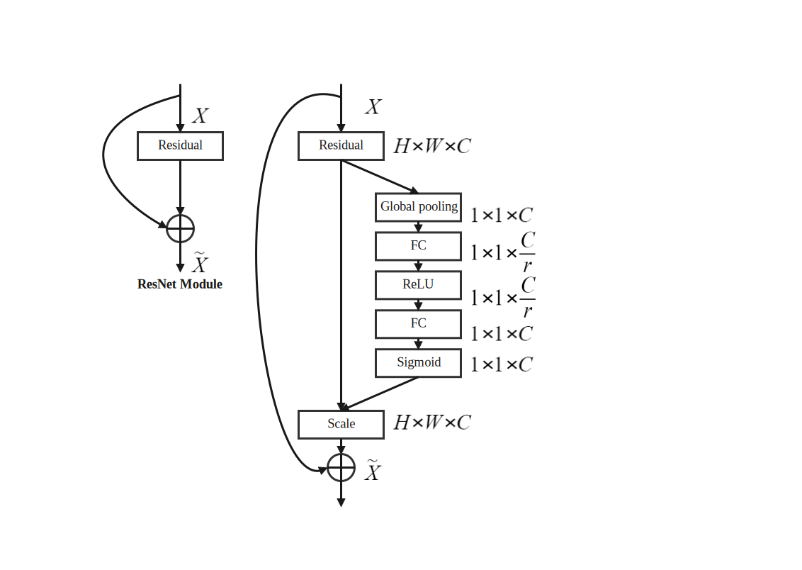
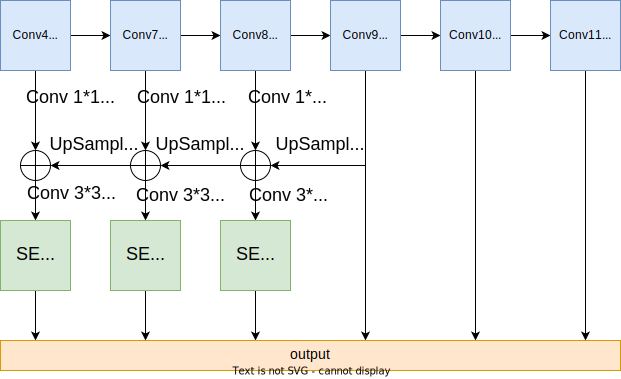
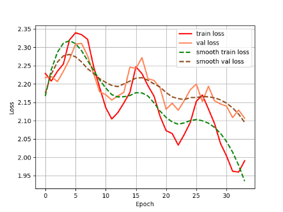
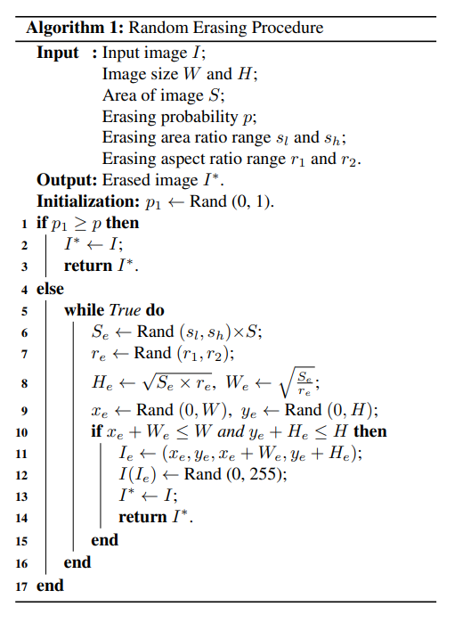

## 口罩摘戴识别任务迭代优化方案

### 小目标与密集目标检测

- FPN 特征金字塔网络 + SE 通道注意力机制模块与 SSD 目标检测网络的结合

  

  

  - FPN 机制将网络深层的特征图通过上采样与浅层特征图进行逐点相加，将深层次网络的语义信息融合在浅层特征图中，弥补了浅层网络语义信息的不足，同时浅层网络感受野较小，适应小物体的检测
  - SE 模块提出了针对通道的注意力机制，通过对逐通道的权重评分指标学习，优化学习到的内容

- 输入 anchor 尺度重设计：对于 300*300 的图像输入，由于浅层特征图负责小目标检测，将浅层特征图（Conv4）的 anchor 尺度由 30 调整为 21，以适应实际检测情况
- 在大尺度（512*512）上进行训练与测试：大尺度的输入图像信息丰富，更能适应对密集小目标的检测
- 改进的 Mosaic 图像增强
  - 随机从数据集中取出经过 SSD 数据增强的四张图片，将其缩放为 150*150 的大小填充到 300\*300 的合成图像位置上，标注框同时经过一定变换
  - 该实现方式是考虑到了口罩检测多为检测小物体，该增强方式极大地提高了检测的召回率，且精度也有所提高，对检测小物体的性能产生了巨大的提升
  - Mosaic 增强极大的丰富了图像的背景，使网络同时学习多个图像的特征
- 小目标随机复制粘贴数据增强
  - 对数据集中的抽取的一张图片，取出其中的小目标物体，在同一张图像中随机选取一个位置粘贴并在 GT 框中增加对应标注
  - 相当于一种过采样策略，使网络参数专注于小目标物体的检测，提高了小目标检测的召回

### 过拟合

- MixUp 图像增强
  $$
  \begin{gathered}
  \tilde{x}=\lambda x_{i}+(1-\lambda) x_{j} \\
  \tilde{y}=\lambda y_{i}+(1-\lambda) y_{j}\\
  其中，x_{i} 与 x_j 为输入网络的训练样本中的两张图片，\lambda 为随机生成在 [0,1] 区间内服从 Beta 分布的值
  \end{gathered}
  $$
  
  - 在 MixUp 数据增强中融合了两张图片的信息，同时将其 Ground Truth 标注框融合，增加了图片的特征表达，对抗训练过程的不稳定性

- 改进的 Mosaic 图像增强

- Label Smoothing（标签平滑分类损失）

  - 对于标准的交叉熵损失函数，设置标签独热码时，将标签按照如下格式格式设置

  $$
  \begin{array}{r}
  y_{i}= \begin{cases}1, & i=\text { target } \\
  0, & i \neq \text { target }\end{cases} \\
  \end{array}
  $$

  - 同时按照标准的交叉熵损失函数计算分类损失
    $$
    CE(y, p)=-\sum_{i}^{K} y_{i} \log p_{i}\\
    其中 p_{i} 为经过 Softmax 网络层分类相应的输出，K 为类别总数
    $$

  - 对于标签平滑损失函数，计算损失时的权重不再是绝对的 0 与 1，而是经过平滑后的标签
    $$
    y_{i}= \begin{cases}1-\alpha, & i=\text { target } \\ \alpha / K, & i \neq \text { target }\end{cases}\\
    其中 \alpha 为平滑系数，项目中设置为 0.05
    $$

  - 标签平滑相当于在标签中加入一定噪声，防止网络参数过度“相信”标签的结果，使多个类的距离向“中间”凑，一定程度地防止了过拟合，提升了模型的泛化能力

### 类别/难易/正负样本不均衡

- Focal Loss
  $$
  \mathrm{FL}\left(p_{\mathrm{t}}\right)=-\alpha_{\mathrm{t}}\left(1-p_{\mathrm{t}}\right)^{\gamma} \log \left(p_{\mathrm{t}}\right)\\
  公式中，\alpha_{\mathrm{t}} 是用于平衡正负样本损失的因子，在项目中设置为\alpha_{\mathrm{t}}=0.5\\ 
  \gamma是平衡难易样本损失的因子，在项目中设置 \gamma=2\\
  通过设置每个类别的 \alpha_{\mathrm{t}} 权值有效地缓解了单阶段目标检测模型中产生大量先验框时正负样本不均衡的问题\\
  通过设置 \left(1-p_{\mathrm{t}}\right)^{\gamma} 解决了难易样本不均衡的问题\\
  对于预测值概率较大的样本，其 p_{\mathrm{t}}值较大，为简单样本\\
  因此压制其损失，使网络专注于 p_{\mathrm{t}} 值较小的难样本\\这一损失值的设置有效地增加了检测精度与召回\\
  \alpha_{\mathrm{t}}设置为 0.5 来对各个类别取均衡，损失主要专注于解决难易样本不均衡的问题
  $$
  

### 实时性与可部署性

- 将骨干网络 VGG16 替换为 MobileNet-V2 轻量化可分离卷积网络
  - 可分离卷积将正常的卷积操作改为逐通道的卷积与逐点卷积两部分，从而将计算复杂度由乘积阶降低到加和阶，降低了运算复杂度
  - 借鉴了残差网络模块：提出了纺锤形的结构进行特征提取，并加入残差连接
  - 使用了 ReLU6 激活函数，限制 ReLU 激活函数的输出范围，防止在移动端部署时造成的精度损失

### 抗干扰环境

- 雾天环境：暗通道先验去雾
  $$
  I(x)=J(x) t(x)+A(1-t(x))
  $$

  - 其中 I(x) 为已知的将要去雾的图像，J(x) 为待复原的去雾图像，A 为全球大气光成分值，t(x) 为透射率

  - 要根据 I(x) 得到复原去雾图像 J(x)，必须计算得到全球大气光成分值与透射率

  - 全球大气光成分值的求解：对于一幅雾天图像取其暗通道图像最大的前 0.1% 的像素点对应于原雾天图像像素位置点的每个通道灰度值的平均值，最后再逐通道的对这些像素点计算得到的三元组取平均，得到 RGB 通道的大气光成分值，A 为一个三元组

  - 经过大量统计观察发现：在一张输入图像中，对图像逐像素点找出其 RGB 三个通道的像素最小值，再对最小值进行腐蚀操作后整幅图像的像素值趋近于 0，也就是形成了暗通道灰度图像，即**暗通道先验**

  - 对上述公式两侧同时除以 A，再在等式两侧同时使用最小值算子，代入暗通道先验可知 t(x) 的近似值
    $$
    \frac{I^{c}(\mathbf{x})}{A^{c}}=t(\mathbf{x}) \frac{J^{c}(\mathbf{x})}{A^{c}}+1-t(\mathbf{x})\\
    \min _{\mathbf{y} \in \Omega(\mathbf{x})}\left(\min _{c} \frac{I^{c}(\mathbf{y})}{A^{c}}\right)=\tilde{t}(\mathbf{x}) \min _{\mathbf{y} \in \Omega(\mathbf{x})}\left(\min _{c} \frac{J^{c}(\mathbf{y})}{A^{c}}\right)+1-\tilde{t}(\mathbf{x})\\
    J^{\text {dark }}(\mathbf{x})=\min _{\mathbf{y} \in \Omega(\mathbf{x})}\left(\min _{c \in\{r, g, b\}} J^{c}(\mathbf{y})\right)=0\\
    \tilde{t}(\mathbf{x})=1-\min _{\mathbf{y} \in \Omega(\mathbf{x})}\left(\min _{c} \frac{I^{c}(\mathbf{y})}{A^{c}}\right)
    $$

  - 为防止去雾过彻底，设置了参数 w 来平滑（论文中设置 w=0.95)
    $$
    \tilde{t}(\mathbf{x})=1-w \min _{\mathbf{y} \in \Omega(\mathbf{x})}\left(\min _{c} \frac{I^{c}(\mathbf{y})}{A^{c}}\right)
    $$

  - 由此我们可以计算得到去雾图像 J(x)

- 黑暗环境：直方图均衡化增加图像对比度

  - 计算每个像素点值出现的概率，并计算像素点值分布函数（即累计概率）
  - 将计算得到的概率乘 255 并四舍五入得到该像素点值的新的对应值
  - 依据对应值关系生成新的图像，即增强后的图像
  - 项目应用中对 RGB 三通道进行逐通道的直方图均衡化

### 学习率策略

- WarmUp：在训练的前几轮，先按照初始的一个较小的学习率线性增加到初始学习率，随后再执行其它学习率策略

  - 有助于减缓模型在训练初期对训练样本的过拟合现象，使学习到的参数变化更加平稳，有助于在后期收敛到更优解
  - 对于深层的网络，在训练初期使用一个小的学习率，有利于网络深层结构参数的稳定性

- StepLR

  - 随着训练的推进学习率也应该呈现按照一定比例缩减，使参数更新更加“小心平稳”，有利于维持训练过程的稳定性，逐渐以一定的小步向收敛的方向学习

  $$
  nowLR=initLR*\sigma^{epoch}\\
  其中，\sigma 参数在训练时设置为 0.94
  $$
  
- 余弦退火学习率
  $$
  \eta_{t}=\eta_{\min }+\frac{1}{2}\left(\eta_{\max }-\eta_{\min }\right)\left(1+\cos \left(\frac{T_{\text {cur }}}{T_{\max }} \pi\right)\right)
  $$

  - 设置学习率按照一定周期像余弦函数一样上下波动，在训练后期上升阶段的学习率有助于跳出局部最优解，同时按照下降的学习率继续像新的最优解收敛，有助于提升模型的性能
  - 下图可视化了一次训练过程中训练后期使用余弦退火学习率 Loss 的变化，可以观察到 Loss 先升高再向更小的 Loss 收敛的过程，由此证明了余弦学习率退火的有效性

  

- 冻结与解冻训练

  先冻结 SSD 模型中属于 VGG 模块的特征提取网络在训练初期不进行参数更新，微调分类与回归头与后续的卷积网络；在训练后期将冻结的网络进行解冻训练。这一技巧有助于维持训练的平稳性。

- 项目最终的训练策略：在训练的前 40-50 个 epoch 使用冻结训练，在前 5 轮 使用 WarmUp 学习率更新策略，随后采用 StepLR 学习率衰减策略；在解冻后使用余弦退火学习率更新策略继续训练约 40-50 个 epoch，直到损失值收敛后停止训练

### 预训练网络的选取

- 采用 VOC07+12 数据集预训练的网络参数，并在口罩检测数据集上进行 Fine Tuning

### 消融实验

#### 口罩检测小数据集(1200trainval+400test)的用于baseline选取的测试性能(mAP0.5)

| VGG16-Pretrained-FT | VOC07+12-Pretrained-FT(cos-warmup-lr) | anchor[0]=21 |    mAP    |
| :-----------------: | :-----------------------------------: | :----------: | :-------: |
|          ✅          |                                       |              |   53.42   |
|                     |                   ✅                   |      ✅       | **57.64** |
|          ✅          |                                       |      ✅       |   54.31   |

#### 口罩检测大数据集(1w+)上训练的测试性能(mAP0.5)

| MixUp  |   Mosaic   | Focal Loss | Label Smoothing |  FPN  |  SE   | 512*512 | Paste |    mAP    |
| :----: | :--------: | :--------: | :-------------: | :---: | :---: | :-----: | :---: | :-------: |
|        |            |            |                 |       |       |         |       |   71.93   |
| p=0.2✅ |            |            |                 |       |       |         |       |   73.17   |
|        |   p=0.2✅   |            |                 |       |       |         |       |   74.59   |
|        |            |     ✅      |                 |       |       |         |       |   73.53   |
|        |            |            |      **✅**      |       |       |         |       |   73.87   |
|        |            |            |                 |   ✅   |       |         |       |   73.73   |
|        |            |            |                 |       |   ✅   |         |       |   74.28   |
|        |            |            |                 |       |       |  **✅**  |       |   78.88   |
|        |            |            |                 |       |       |         |   ✅   |   73.72   |
|        |            |            |                 | **✅** | **✅** |         |       |   74.94   |
|        |   p=0.2✅   |            |                 |   ✅   |   ✅   |         |       |   75.20   |
|        |   p=0.2✅   |     ✅      |                 |       |       |         |       |   73.72   |
|        |   p=0.2✅   |            |        ✅        |       |       |         |       |   72.94   |
| p=0.2✅ |   p=0.2✅   |     ✅      |                 |       |       |         |       |   72.74   |
| p=0.2✅ |   p=0.2✅   |            |        ✅        |       |       |         |       |   73.55   |
|        |   p=0.2✅   |            |      **✅**      | **✅** | **✅** |         |       |   77.26   |
|        | **p=0.2✅** |            |      **✅**      | **✅** | **✅** |  **✅**  |       | **81.11** |

## 肺炎胸片检测任务迭代优化方案

### 数据增强

- Random Erasing

  - 对于一张输入的图像按照一定概率进行 Random Erasing 数据增强
  - 首先根据输入图像计算图像的面积，并随机生成一个因子计算随机擦除的矩阵条面积的大小，依据随机生成的长宽比确定最终擦除部分矩阵条的宽高
  - 在图像的随机位置填充随机生成的矩形条（矩阵条内像素为随机生成的 0-255 之间的值）

  

- MixUp

### 多尺度训练与多尺度测试

- 训练时首先按照 ResNet50 标准输入尺度 224*224 进行缩放后训练，随后在训练稳定后，每一轮再随机从[224,256,288,320,352,384,416,448] 随机抽取一个尺度进行训练
- 测试时在 [224,256,288,320,352,384,416,448] 尺度下进行测试，利用投票法获得最终的预测结果
- 多尺度训练与测试使模型的健壮性增强，训练时图像尺度的抖动增强了模型的泛化能力，且多尺度的预测也极大地提升了模型性能

### 消融实验

| MixUp | Random Erasing | Mutiscale Training/Testing(Voting) |  Accuracy  |  F1-Score  |
| :---: | :------------: | :--------------------------------: | :--------: | :--------: |
|       |                |                                    |   97.00%   |   97.09%   |
|       |       ✅        |                                    |   97.50%   |   97.56%   |
|   ✅   |                |                                    |   97.75%   |   97.80%   |
| **✅** |                |               **✅**                | **98.50%** | **98.50%** |

